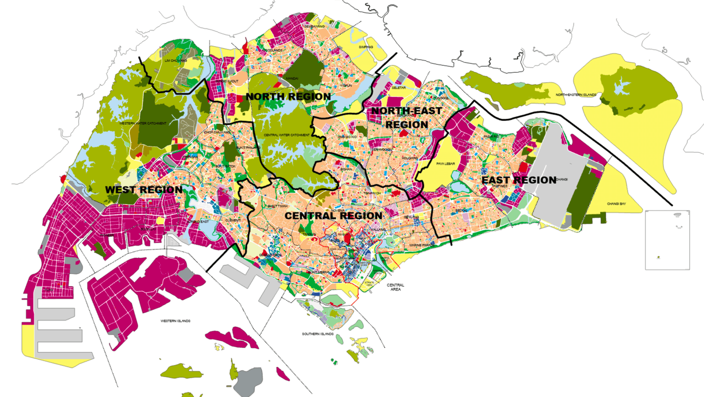
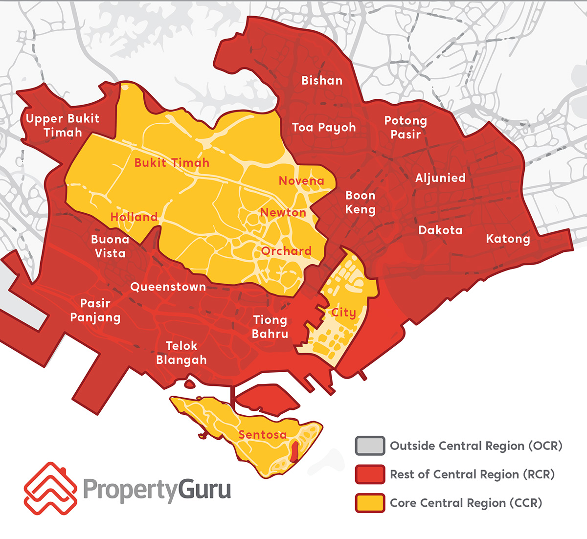
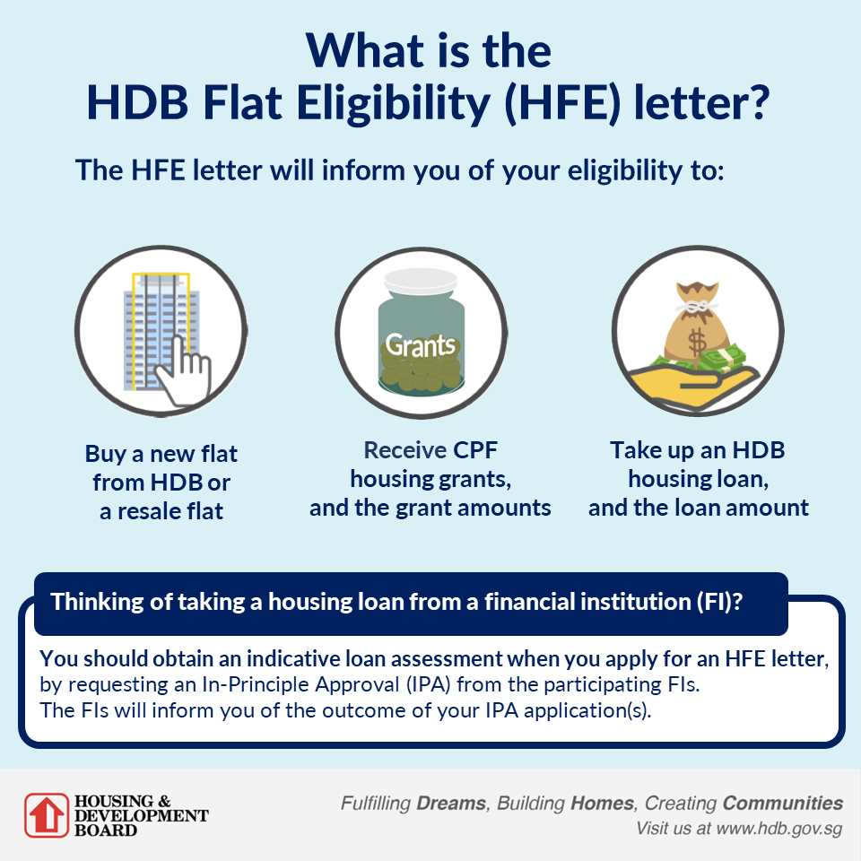

## 你为什么要买房？

这个永远是第一个需要考虑的问题，需求决定了筛选范围和后续的所有

> "哥，请问您买房子是为了什么呢？"
> "咳咳，对我这种漂泊多年的人来说，买房买的不只是砖瓦！而是让漂泊的月光，终于找到落脚的屋檐～"
> "大哥。。。。。我问你是买房是用来自住还是投资。。。"

如果单纯是投资，那你需要考虑的因素会更多：**地段，目前的经济形势，贷款利率，付出的成本，收益的期望**，这个需要更为专业的数学计算和经济形势判断能力，我这里就不展开了。因为我是为了自住，本文主要还是讲一下自住的情况 --- 如何找到并且买到自己心仪的要住很久的房子。

我认为，需求我们可以从以下几个方面展开： **种类，位置，大小/房型，年龄，配套设施**。首先就是种类，Condo 和 HDB 的选择其实比较看个人预算 （本文不考虑买 Landed大佬～），相同地段相同年龄的 Condo 大概是 HDB 的 2 倍左右的裸房价格，但是提供了更好的层高，宽敞的阳台（某些 HDB 也有阳台），更好的小区设施，相对更富有的邻居们。。。而 HDB 则是相对更便宜的，楼下也会有更方便的超市和 Food Court。位置和大小其实有时候也决定了种类的选择。如果预算不变的前提下，买 HDB 和老房子，能得到更好的位置和更大的居住空间，相对需要妥协的则是，老房子的水电，居住环境和房型都会比新房来的要差一些，同时保值空间有所受限。如果你买 Condo，新房型的空间会比老房型要小，同时会有更多浪费的走廊空间，这样的话又会是另一种选择困难症。所以一定要分析清楚自己的需求对于上面的 factor 做一个排位后再开始看房。

### ZZ的个人理解

对于自住来说，首先我不会分析太长远的需求，超过 5 年以上的需求我不会考虑在内--因为需求过于遥远，我根本不知道会不会变化。如果你是互联网行业从业者，你肯定懂：过早优化，过早为未来做打算只会导致 over engineering ---- 所以我没有考虑房子周围的教育设施（xD)是否优异；其次，对于我来说，相对于室外小区设施和周边环境，我会把室内空间排在更前面：我更愿意选择大一点的HDB，而不是 CONDO，因为同样大小的 Condo 会超出预算也会超出我能够贷款的额度（下面讲解贷款问题）。根据我个人的经验，日常两个人住的话，500-600sqf 能够满足基本需求，800sqf 会比较舒适，1000sqf 就能规划房子不同的功能分区了。我更想要大一点的空间能够定义不同的功能分区～ 

再下面就是位置，房价的核心因素就是位置，除了 OCR，RCR，CCR 概念外，还要对于🇸🇬的生活环境有基本的概念，比如东边整体感觉比西边 Chill，比如西边大学城附近更好出租，再比如你看房的区域所在选区的议员党派都是什么；附近的[政府用地划分和未来的方向等等](https://eservice.ura.gov.sg/maps/)；

我自己的理解是，房子一定要在 MRT 步行 5min 距离内，一定要生活便利，附近有 mall。这个就要对自己的行为方式有所理解，自己日常究竟是不是喜欢做饭，是不是喜欢早上赶 bus 转地铁，还是能够有私人交通工具--我有一个天天骑摩托车的前同事，我实在是觉得爽到爆，他根本不需要考虑地铁站的问题，任何地方都在他的覆盖范围。**另外一个很核心的冷知识就是如果是上班族 bus 转地铁，bus 虽然只两站但是加上等车可以多花出来十多分钟，而十多分钟相当于地铁四站的距离；相比于大汗淋漓的转地铁，可能距离工作地点更远但是离地铁站更近的房子你的通勤时间会更短**。

在下面就是房子年龄，这个要看买方的年龄和预算。首先，如果买自己的年龄+房子剩余年限 < 95 年的房子，HDB 会对于贷款上限做限制，这个需要注意。其次就是老一点的你更难找到保值空间比较好的房子，选房的时候会消耗你的精力和时间。所以我选择了 2005 年后建的房子，老房子就过滤掉了。对于Condo来说，配套设施和房型都是在不断变化的，像 2020 年后新 Condo 的 common room 都在不断变小，窗户面积也会被空调台侵占，但是**整体来说多样性是远远大于 HDB 的**

所以，我的需求就比较明确了，1000sqf 左右，2005 年后见的HDB，距离 MRT最多5 分钟，不要太偏僻比如 NTU，三巴旺，然后如果有 mall 则会更好。

## 搞定购房资格和预算

购房资格这个对于大家来说算是比较基础的问题，对于 Condo 来说，只有想买就能买，付对应身份的税款就好了，后续的流程包括找中介，看房，敲定购房协议，找银行 Banker 确定贷款，找律师楼签订购房协议，搞定交接等等，如果有中介，他会帮你安排所有的手续；对于 HDB 来说，购买手续就比较复杂了，当然不是想买就能买，如果你能搞定购买资格（这方面网上的攻略很多的，比如 SC+PR，SC+LTVP，PR+PR 等等等，如果不懂也可以 PM 我），整个流程可以从申请 [HFE](https://www.hdb.gov.sg/residential/buying-a-flat/understanding-your-eligibility-and-housing-loan-options/application-for-an-hdb-flat-eligibility-hfe-letter) 开始，要自己从官网一点一点填写表格，通过后会有一年的时间有效期，有效期内可以买房～（所以想买房的小伙伴可以现在就开始申请了！） 对于价格和预算来说，可以去 property guru 上面查询，也可以去 [HDB 官网](https://services2.hdb.gov.sg/webapp/BB33RTIS/) 查询某一栋楼的历史成交就价格，这个价格范围可以用做参考。 HDB 成交价格水分不大，市场也非常透明。但是这里面请注意，某一栋楼的历史成交就价格并没有展示出来层数，同一栋楼不同层数的价格是不一样的

预算是一个基准线，其实蛮重要的，因为手里的现金和预算决定了贷款的比例和贷款的期限。HDB 可以拿政府的津贴，也可以拿政府的 HDB 贷款，大部分时间固定 2.6% 的利率，在宽松时期会比市场的银行利率高，但是如果市场利率涨到了 3%，HDB 贷款又会是划算的。SG 的贷款都是等额本息【TODO】的计算方式，这个还是在短暂在银行贷款部门任职的三个月学到的，等额本息的特点就是贷款前期还的利息会比后期还得多，也就是说前期每个月 4k 的按揭，可能 3k 都是利息（神奇的计算方式但是确实是这样的）。银行贷款可能会利率浮动，在宽松时期，会大幅度低于 2.6%，可以参考 SORA 利率看最近的利率变动情况，一般固定贷款利率会比SORA 高出来 0.5-0.6% 左右。

同时根据贷款金额的不同，每家银行贷款的 Banker 能给到的最低利率 package 也不同，可以多和不同的 banker聊聊，再做决定。一般 fix的相比于浮动的 package 接受的人更多因为更加保守，比如 covid 期间如果你 fix 了三年的低利率，可能完整的跳过了高利率的周期，但是如果你在高利率周期 fix 了很久的 package，则会比巨亏。

### ZZ的个人理解  

> 银行是有银行家帮助他算账的，你可以小赚，但是银行绝对不亏。 ----鲁迅
这是个充分竞争的市场，你可以从不同银行家之间对比拿到对你最优惠的价格。如果你贷了很多钱，则是帮助银行完成了 kpi，也帮助银行锁定了未来的收益，因为看我文章的朋友们都是优质 credit profile用户，大家都会体面的还贷款。所以如果能贷款 1mil 以上，你则有很大机会对利率进行砍价，所有的银行亦是如此。所以利率 package 能拿到多少 1.取决于经济周期 2. 你贷多少钱，越多越低。 3. 谈判技巧。那么在浮动利率和固定利率见如何选择呢？答案是完全看个人的风险 profile，zz 是选择了 SORA+0.4% 的浮动利率三年，赌他一手这三年不会加息。。。。。

下面说下一个比较关键的问题，贷多少钱？假设你有一大笔现金，你真的要花完现金做首付吗？假设贷款非常多的话，真的会压力非常大吗？假设你的投资收益能够到每年 2.5%？4%的话是不是可以多贷款一点，现金用来投资比较好呢？zz 这边自己写了一个贷款计算器供大家参考，大家可以进去选择你们的现实情况，计算器会帮你算出来一个最优解。（当然这个问题过于复杂，计算器只是一个参考）

## 你真的需要中介吗？

在搞清楚需求，资格，预算之后，就是看房了。这时候你会发现新加坡市场都是中介带着看房帮你 handle 很多事情的，市面上的中介真的五花八门甚至你的朋友圈也有同龄人的中介供你咨询。但是你真的需要中介吗？这个问题也是可以客观分析的：
如果你买 Condo，你的购房中介大概率是不会收取中介费的，一般会和卖房中介一起分摊卖房的中介费（当然也是包括在房价中了～），只不过你没有中介也不会便宜。HDB 的话，目前市面上大部分是收取 1% 购房款作为中介费。
那么中介重要吗？我这里给一个比较客观的回答：取决于你买什么样的房子和需求。

中介的主要作用是帮助你进行挑选你心仪的房子，带你看房，利用个人经验教给你一些知识同时帮你谈判价格。至于他能帮你谈判到多少钱完全取决于他的水平。中介能帮助你省很多自己做功课的时间，帮助你做很多 admin 的工作，也能帮助你给出具体的贷款建议等等等。所以需要请中介吗？

### ZZ的个人理解

这部分是我个人比较主观的理解，大家看一下就好：

1. 如果你不是一个喜欢折腾，执着于体验购房中间的各种谈判/踩坑/博弈/做决定流程，请无脑请中介帮你调房选房做 paper work，否则你会很痛苦----做自己痛苦的事情有概率做不好所以可能买不到心仪的房子。
2. 如果你想买 condo，请无脑请中介，因为本来中介费也不用你显性支付，卖方会帮你支付中介费。对于 condo 买家来说，可能选择性非常多，整个小岛符合你需求的房子可能蛮多的，自己看房真的会非常累，也会很影响你其他的生活。如果有中介，他会开车带着你转遍新加坡一个一个帮你筛选。
3. 如果你是买 HDB 但是预算内满足自己需求的房子也很多，对于各个区域，各个小区，里面的房型设施怎么选也不太懂，想省心---请无脑请中介吧，筛选房子的过程会比较漫长也需要时间---如果你看上了一个房子，同时还有着很多其他选择，HDB 的博弈市场很可能等你做好选择就已经卖掉了。
4. 如果你像我一下，需求和要求比较多：
  > 所以，我的需求就比较明确了，1000sqf 左右，2005 年后见的HDB，距离 MRT最多5 分钟，不要太偏僻比如 NTU，三巴旺，然后如果有 mall 则会更好。
  然后这些需求筛选下来，只有很小一部分房子满足需求了，然后看房也比较集中，这个时候，如果你愿意尝试探索，愿意试错，我是鼓励你不用中介去自己尝试购房的。ZZ 就是这样，下面会详细描述踩的坑，各种遇到的困难，但是成功后的满足感也是满满的。如果你有兴趣可以继续读下去，或许能帮助你剩下上万的中介费～

## 如何看房和区分好坏（无中介）

房型，楼层，周边设施，升值空间，朝向，噪音，小区的户数

### ZZ的个人理解

### ZZ的个人谈判技巧

## 成交了！然后呢？

## 装修！装修！

2023-01-23
