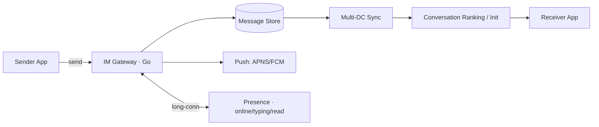
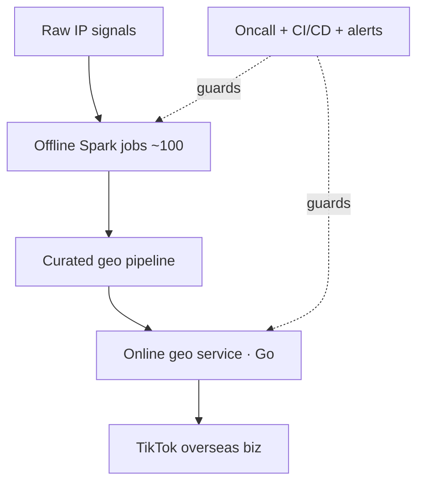
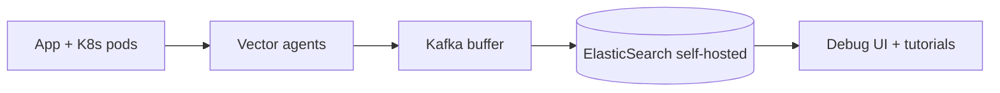

# CAREER_DOSSIER · 战役档案资产库 (v1草案)

> 状态：v1 草案 —— 完全基于 owner 已提供材料萃取（简历 LaTeX + `content/about.md` + 已发布博文）。
> 无任何编造的量化指标：凡简历/博文未给出的数字，一律记为 `TBD` 并列入文末「待 owner 确认清单」。
> 本文件是 `BRAWUKA-37`（Interactive Flight Path / Career Timeline）唯一数据源说明；
> 机器可读数据源见 `lib/career-dossier.ts`（类型 + 节点数组），校验见 `scripts/career-dossier.check.ts`。
> 标注约定：`[VERIFIED:来源]` = 原文可查；`[NEEDS-OWNER]` = 待自正确认后才可公开展示。

关联：BRAWUKA-41（本工单）→ 解锁 BRAWUKA-37 Stage 2；设计语言遵循 `docs/DESIGN.md`（数字暗房与物料印社）。

---

## 0. 信息来源清单（v1 穷尽）

| # | 来源 | 覆盖内容 |
|---|------|----------|
| S1 | Owner 简历 LaTeX（2026-09-03 评论原文） | NTU / WISE / Maribank / Bondee / ByteDance / Side Projects / U-Wave / Skills |
| S2 | `content/about.md`（2022-01-15） | Transforma Robotics / VISA / uWave / ByteDance 早期（AGW 实习、IM 中台、Location） |
| S3 | `summary_tiktok`（2023-09-12） | ByteDance 两年全弧线：备胎面试、混乱实习、伪需求低点、台湾 mentor、机遇→迷茫循环 |
| S4 | `summary_2022`（2023-01-23） | Location 团队深渊：百级离线任务、7×24 oncall、IP 强制展示价值观冲突、出走与和解四原则 |
| S5 | `summary_2023`（2023-12-24） | Bondee DevOps 转型心态、羽毛球 50+ 场、摄影风格（85mm/胶片/银河/无人机/夜景高反差） |
| S6 | `I_hate_IM`（2022-06-07） | IM  Product 批判：已读/正在输入/最后上线对隐私的侵蚀、 Lark/Buzz 工作 IM 异化 |
| S7 | `study/im_architecture`（2022-01-27） | IM 后端全景：存储 / APNS+FCM 推送 / 长连接在线状态 / 会话模型（配 17 张手绘架构图） |

**已知来源矛盾（已标记，未自行裁决）：**
- D1：S1 简历不含 Transforma / VISA，S2 含。v1 保留两段并标 `[NEEDS-OWNER]` 决定去留。
- D2：S1 把 ByteDance 记为 `Jan 2021 – Sep 2023` 一段；S2 拆为实习（Jan–May 2021）+ 全职（Aug 2021 起）。v1 采用 S2 拆分（与 S3 叙事一致）。

---

## 1. 时间轴主干（Timeline Chronicles）· 12 节点

| # | 起止 `[VERIFIED]` | 组织 / 角色 | 战役代号 | 核心主线 |
|---|-------------------|-------------|----------|----------|
| N01 | 2017-08 – 2021-05 `[VERIFIED:S1,S2]` | NTU 计算机工程本科（全额 Merit Scholarship） | 地基层 BEDROCK | CS 基础 + FYP + 以战代练（同期 Transforma / uWave） |
| N02 | 2019-06 – 2019-12 `[VERIFIED:S2]` | Transforma Robotics · 软件实习生（第一份工作） | 独行者 SOLO-BUILD | 唯一开发者：Android(Java) 从设计到交付，<2 个月向客户演示 `[NEEDS-OWNER]` 去留 |
| N03 | 2019-08 – 2021-01 `[VERIFIED:S1,S2]` | U-Wave 联创 + 全栈 | 校园闪电战 CAMPUS-BLITZ | Flutter 重构客户端 + Spring Cloud 微服务；20k 注册 / 4k DAU `[VERIFIED:S1]` |
| N04 | 2020-05 – 2020-07 `[VERIFIED:S2]` | VISA Inc 暑期实习（SM + PO） | 60 进 2 HACK-60 | 全球实习黑客松 60 队中获 1st Runner-Up `[NEEDS-OWNER]` 去留 |
| N05 | 2021-01 – 2021-05 `[VERIFIED:S1,S2]` | ByteDance 实习 · 中台 API 网关 (AGW) | 守门人 GATEKEEP | 自助诊断工具 + 用量预估工具（路由/限流/协议转换 PaaS） |
| N06 | 2021-08 – 2021-10 `[VERIFIED:S2,S3]` | ByteDance 全职 · 私信中台（新人期） | 浓雾编队 FOG-FORMATION | 自动化机器人（首个端到端 feature）→ 诊断工具伪需求低点 → 台湾 mentor 入场 |
| N07 | 2021-10 – 2022-06（约） `[VERIFIED:S4,S1]` | ByteDance · Location 海外 IP 定位负责人 | 孤岛守望 LONELY-ATLAS | 一人撑海外全链路：近百离线任务治理 + 7×24 oncall + ASEAN 精度；2022.01–02 Spot Bonus `[VERIFIED:S1]`；以价值观冲突收尾（强制 IP 展示 vs GDPR/CCPA） |
| N08 | 2022-06 – 2023-09 `[VERIFIED:S1,S3]` | ByteDance · TikTok IM（架构组 → 业务组 Tech Owner） | 全球心跳 GLOBAL-HEARTBEAT | Golang 微服务多活同步、会话排序初始化优化；欢迎语/自动回复/在线状态/已读+正在输入跨 DC；1 年后晋升 `[VERIFIED:S1]`；IM 安全合规 PoC（美/EU）；Bi-Monthly Spot Bonus `[VERIFIED:S1]` |
| N09 | 2023-09 – 2024-04 `[VERIFIED:S1,S5]` | Bondee · Senior SWE（DevOps，新加坡首位 SWE） | 降本刀锋 COST-BLADE | K8s 管理平台 + Pod 调试；日志 AWS → 自建 Vector+Kafka+ES；SDK 教程；兼 SE/SRE/BD |
| N10 | 2024-04 – 2024-07 `[VERIFIED:S1]` | Maribank · Senior Backend（Loan&Credit） | 银行学徒 LEDGER-APPRENTICE | Cashloan + SME Termloan（Java）；风控/合规/SDLC；业余 RAG+LLM 智能客服 Bot |
| N11 | 2024-08 – 至今 `[VERIFIED:S1]` | 独立 Side Projects（Local-First / Vibe Coding） | 车库暗房 GARAGE-DARKROOM | Loan Calculator / Panda Wanderer / Project500（内存实时计算引擎）；母机 + Cloudflare + Zeabur |
| N12 | 2024-11 – 至今 `[VERIFIED:S1]` | WISE · Full-Stack Product Engineer | 缺陷猎手 DEFECT-HUNTER | Payment Defects & Incident：Agent 状态追踪、队列管理、跨组升级、赔偿链路重构；主导产品设计；AI Agent 自动化提效 `[NEEDS-OWNER]` 脱敏边界 |

---

## 2. 核心战役深挖（Technical Deep Dives）

### D-A · TikTok 全球 IM（N08）—— 为什么值得当主展台
- **极端场景 [VERIFIED:S7,S3]**：全球多 DC 用户无缝漫游；弱网/跨区消息不丢不重；数千群聊 + 机器人轰炸下 1000+ 未读仍可用（S6 实证）。
- **架构取舍 [VERIFIED:S7]**：服务端存档 + APNS/FCM 推送 + 长连接在线直投三轨并存；
  在线免打扰推送、会话归属（conversation-membership）建模、已读/正在输入走长连接而非存储链路。
- **产品伦理对冲 [VERIFIED:S6]**：作者亲笔批判已读回执/正在输入/最后上线对隐私的侵蚀 ——
  展台可并置「工程师实现它」与「作者质疑它」，这是全站最具人格张力的叙事点。
- **文本架构图（mono-color 印刷风，BRAWUKA-37  렌더링 用）**：

### D-B · 孤岛守望 IP 定位（N07）—— 至暗时刻
- **瓶颈 [VERIFIED:S4]**：近百离线 Spark 任务抢队列资源 + 7×24 oncall 电话不停；
  根治靠自研分析编排优化资源利用，而非加机器。
- **一人成军 [VERIFIED:S1,S4]**：海外唯一开发 + 带 1 实习生 + 建 CI/CD 与在线/离线任务标准告警。
- **价值观冲突 [VERIFIED:S4]**：大陆强制展示 IP（省/国家）功能 exactly 由定位团队提供；
  作者自问「是不是侵犯隐私的帮凶」→ 四原则和解（不做讨厌之事/枪口抬高一寸/拒绝重复性消耗/不熬夜 oncall 透支健康）。
- **文本架构图**：

### D-C · 降本刀锋 Bondee 日志（N09）—— 工程 impact 模板
- **取舍 [VERIFIED:S1]**：AWS 托管日志 → 自建 Vector + Kafka + ElasticSearch；
  动因 = 成本与性能双优化 `[NEEDS-OWNER]` 具体百分比/延迟数字。
- **一人三岗 [VERIFIED:S1]**：首位 SG SWE，身兼 SE + SRE + BD（含 SDK 教程与文档）。
- **文本架构图**：

### D-D · 校园闪电战 uWave（N03）—— 创业全栈证据
- **设计 [VERIFIED:S1,S2]**：Flutter 客户端重构 + Spring Cloud 微服务重设计（含推送/鉴权）；
  20k 注册 / 4k DAU（2020 末）`[VERIFIED:S1]`。
- **人格注脚 [VERIFIED:S3]**：大四下自告奋勇 part-time（"挣点外快"）—— 学习/赚钱两不误的自驱样本。

---

## 3. Impact 档案（只收录原文可查数字）

| 节点 | 指标 `[VERIFIED]` | 数值 |
|------|-------------------|------|
| N03 uWave | 注册 / DAU | 20k / 4k `[VERIFIED:S1]` |
| N04 VISA | 黑客松名次 | 60 队中第 2 `[VERIFIED:S2]` |
| N07 Location | Spot Bonus | 2022.01–02 `[VERIFIED:S1]`；oncall 负载：「近百离线任务，报警电话没停过」`[VERIFIED:S4]`（定性原文） |
| N08 IM | 晋升 / 奖金 | 1 年后晋升；Bi-Monthly Spot Bonus `[VERIFIED:S1]` |
| 生活 | 羽毛球 | ≥50 场/年（2023），教练课自 5 月 `[VERIFIED:S5]` |

> 其余一律 TBD，禁止用「大幅提升/显著优化」类空洞形容词占位 —— 待 owner 逐项确认（见 §6）。

---

## 4. 动效叙事脚本（BRAWUKA-37 插槽契约）

遵循 DESIGN.md §1.2.2 航线履历 + §2 决议 #8（桌面横向胶片长卷 Scrub，移动折叠为垂直轴）：

1. **Act 0 显影**：35mm 负片画框入水渐显 → 主标题 `Zizheng Lyu — Engineer & Visual Storyteller`。
2. **Act 1 地基层（N01–N05）**：横向慢卷 + 纸面微浮雕卡；N03 Bento 大卡（20k/4k 计数器滚动）。
3. **Act 2 深渊与心跳（N06–N08）**：卷速放缓；N07 暗房安全红 `#E54B4B` 警示帧 + oncall 电话脉冲；
   N08 主展台：三轨架构图随滚动逐层点亮（Gateway → Store → Push → Presence → Multi-DC Sync），抽屉内嵌 S6/S7 原文切片。
4. **Act 3 刀锋与暗房（N09–N12）**：N09 日志管道数据流动画（Vector→Kafka→ES 粒子）；
   N11 三个 side project Bento 小卡 + 外链；N12 当前帧「进行中」呼吸光标。
5. **Act 4 人格穿插**：N07/N08 之间插入 S6 金句卡；N09 之后插入摄影卡（85mm/胶片/银河/无人机）与羽毛球卡（50+ 场/未赢老板）。
6. **无障碍**：全程 `prefers-reduced-motion` 降级为静态锚点跳转；移动端垂直轴 + Pocket Zine 卡片横划。

---

## 5. 配图与 EXIF 指引（待 owner 供图）

- P1 主视觉：暗房风自画像或 A7M4 + 35mm F1.4 GM 工作照 `[NEEDS-OWNER]`。
- P2 N03：uWave 校园 app 历史截图 `[NEEDS-OWNER]`。
- P3 N07：oncall/值班主题概念图（可用 mono-color 插画代替真实截图，避免泄密）—— **严禁出现任何 ByteDance 内部系统截图**。
- P4 N08：S7 手绘架构图重绘为 mono-color 蓝图版（已有 fig1–fig17 在博文内，可复用公开展示部分）。
- P5 生活：2023 代表作 3–4 幅（夜景高反差优先）+ EXIF 探针（机身/焦段/光圈/快门/ISO）`[NEEDS-OWNER]`。
- P6 N11：三个 side project 封面截图 `[NEEDS-OWNER]`。

---

## 6. 待 owner 确认清单（v2 前必须闭环，10 问以内）

1. Transforma（N02）与 VISA（N04）是否保留在公开时间轴？（简历已删，about 有）
2. WISE（N12）哪些模块可公开？Agent 状态追踪/赔偿链路有无脱敏红线？
3. Bondee 日志迁移有无可公开的成本/延迟数字？（% / P99 ms 二选一即可）
4. IM（N08）有无可公开的量级数字？（如多 DC 数量、会话排序耗时变化；无则保持定性）
5. Location（N07）离线任务「近百」能否精确到数量级？ASEAN 精度提升有无 %？
6. uWave 20k/4k 口径确认（注册总量 vs 峰值 DAU，时间点 2020 末？）。
7. Side project 三个 URL 是否仍有效？Project500 是否可公开访问？
8. 供 3–4 幅摄影代表作 + EXIF（或授权直接用 Instagram brabalawuka 公开图）。
9. S6《I_hate_IM》并置展出是否授权？（工程师 vs 批判者双面叙事）
10. S7 手绘架构图是否有不适合公开的内部细节？

---

## 7. v1 局限声明

- 本稿未做任何新访谈（owner 明确「先按简历和文章构思第一版」）；v2 在 owner 回复 §6 后迭代。
- WISE/Maribank/Bondee 均为简历单条 bullet 级信息，未展开 —— v2 深挖时每家补一次 15 分钟 grill。
- 所有 `[NEEDS-OWNER]` 内容在 BRAWUKA-37 渲染前必须清零或隐藏对应节点。
